# ECHO Online

### A local-first AI browser assistant that can understand pages, operate websites, remember useful information, and automate repeatable work—by text or voice.

[](manifest.json)
[](manifest.json)
[](tsconfig.json)
[](tests/extension.test.cjs)
[](package.json)

ECHO lives inside Chrome as an animated assistant, a persistent side-panel chat, and a complete settings dashboard. It can summarize and explain pages, navigate and click, fill safe form fields, extract structured information, manage tabs, record workflows, monitor pages, search the web, work with video transcripts, and help rewrite selected text.

The unusual part is what happens behind the interface: ECHO tries fast local methods before contacting a cloud model. Simple requests stay quick and private, cached answers are reused, supported Chrome installations can use on-device AI, and cloud models are reserved for work that genuinely needs them.

> [Download the ready-to-install ECHO V2 ZIP](package%20for%20sharing/Echo_Web_Assistant_v2.zip) · [Build from source](#build-from-source) · [See everything ECHO can do](#complete-feature-guide)

---

## See ECHO in motion

[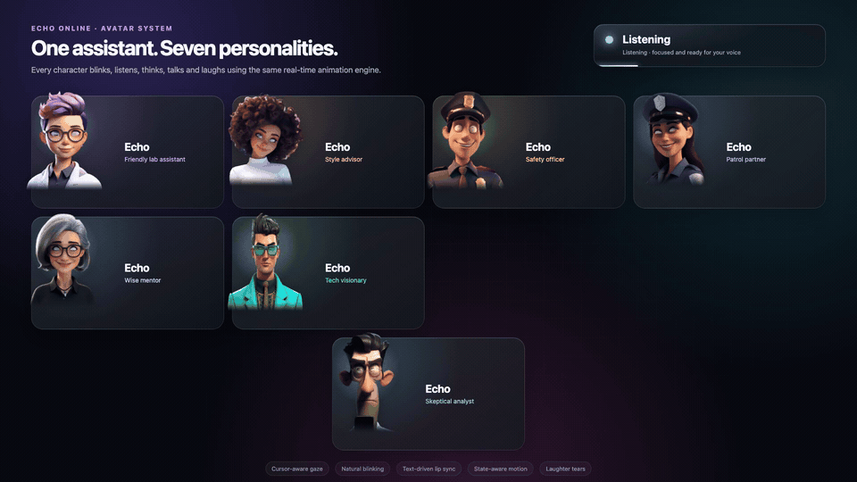](docs/media/echo-avatar-expressions.mp4)

**[Play the full-resolution MP4](docs/media/echo-avatar-expressions.mp4)** — all seven avatars move through idle, listening, thinking, talking, and laughing states. The animation includes cursor-aware gaze, natural blinking, head and body motion, text-driven mouth shapes, happy squints, and animated laughter tears.

Every avatar uses the real production animation component and recolors the floating assistant, side panel, and settings interface with its own theme.

---

## What ECHO feels like to use

### On any webpage

Press `Ctrl/Cmd + Shift + E` to wake ECHO, click the avatar to speak, or long-press it to open the command bar.

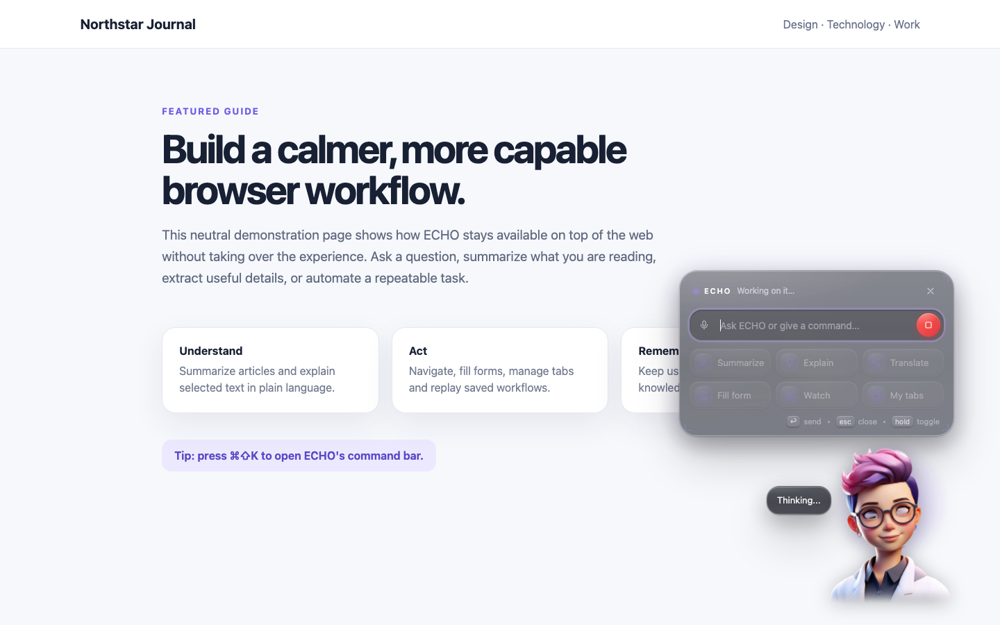

The floating assistant stays above the current page without replacing it. Quick actions provide one-click access to summarization, explanations, translation, form filling, page watching, and tab management.

### In the side panel

Press `Ctrl/Cmd + Shift + O` for a persistent conversation that follows you between tabs.

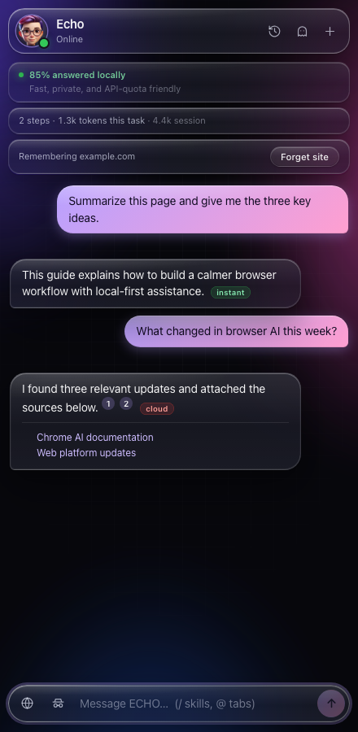

Every answer can show which intelligence tier produced it. The panel also displays token usage, local-routing statistics, remembered-site status, citations, recent browser actions, temporary chats, private-agent mode, saved skills, and attached tabs.

### When ECHO notices an opportunity to help

With proactive suggestions enabled, ECHO can offer a local summary on a long article or help with an empty form. It does not start a model call until you accept.

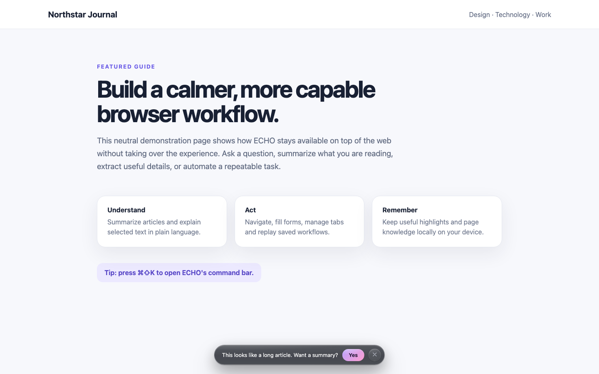

### When writing on the web

Select text in a field and use ECHO Writer to rewrite it. Review the result, copy it, or replace only the original selection.

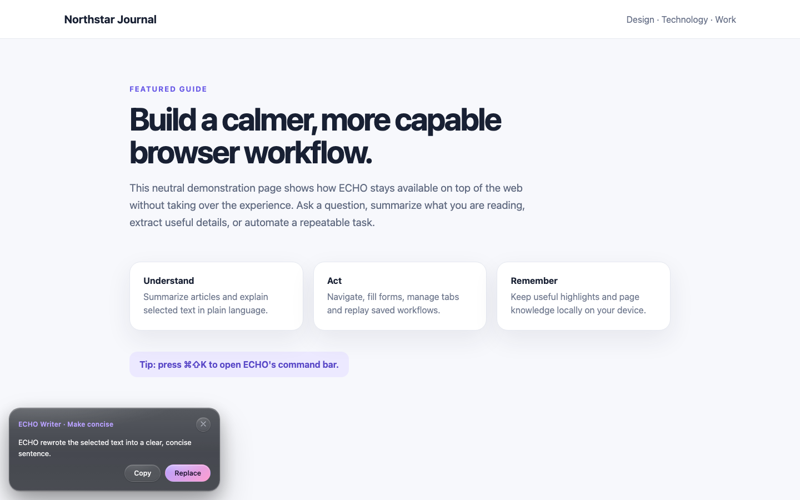

---

## Install ECHO V2

### Option A — Use the ready-made ZIP

This is the easiest route for non-technical users.

1. [Download `Echo_Web_Assistant_v2.zip`](package%20for%20sharing/Echo_Web_Assistant_v2.zip).
2. Unzip it. The extracted folder contains the production extension files.
3. Open Chrome and enter `chrome://extensions` in the address bar.
4. Turn on **Developer mode** in the upper-right corner.
5. Choose **Load unpacked**.
6. Select the extracted folder—the folder that contains `manifest.json`.
7. Pin **ECHO Online** from Chrome's Extensions menu for easy access.
8. Open ECHO's **Options** page to choose an avatar, provider, language, and privacy preferences.

Chrome may remove a manually loaded extension when its source folder moves. Keep the extracted folder in a permanent location.

### Option B — Build from source

Use this route if you want to inspect, modify, or contribute to the code.

```bash
git clone https://github.com/thedeepakreddy/Echo-Web-Assistant-Extension.git
cd Echo-Web-Assistant-Extension
npm install
npm run build
```

Then open `chrome://extensions`, enable **Developer mode**, select **Load unpacked**, and choose the generated `dist/` folder.

### Do I need an API key?

No API key is required for local features such as direct navigation, page extraction, safe form filling, saved memories, workflow management, highlights, cached answers, and the built-in extractive summarizer.

An API key is required when a request reaches the cloud tier. ECHO supports:

| Provider | Best for | Configuration |
| --- | --- | --- |
| Anthropic Claude | Complex reasoning, tool use, cited web search | Anthropic Console key and model ID |
| Google Gemini | General assistance and Google-grounded search | Google AI Studio key |
| Groq | Fast responses and a useful free starting tier | Groq key and supported model |
| Together AI | Open-model choice | Together key and model ID |
| OpenRouter | Access to multiple hosted models | OpenRouter key and selected model |

API keys stay in Chrome's local extension storage. They are excluded from ECHO's data export.

---

## First five minutes

After installation, try these commands:

```text
summarize this page
explain the selected text in simple words
extract all emails from this page
find every price on this page
open YouTube and search for lo-fi music
fill this form
list my open tabs
remember that I prefer short bullet points
what did I read today?
record a workflow
watch this page and tell me when the price drops below 800
```

Useful controls:

| Action | Shortcut or gesture |
| --- | --- |
| Wake or hide the floating assistant | `Ctrl/Cmd + Shift + E` |
| Open the persistent side panel | `Ctrl/Cmd + Shift + O` |
| Open the in-page command bar | `Ctrl/Cmd + Shift + K` or long-press the avatar |
| Start/stop voice input | Click the avatar |
| Move the assistant | Drag the avatar |
| Run a saved skill | Type `/shortcut` |
| Attach an open tab to a question | Type `@` in the side-panel composer |
| Ask from the address bar | Type `echo`, press `Space`, then enter a request |

---

## Interface tour

### Floating in-page assistant

The in-page experience includes:

- Seven animated character choices plus the classic reactor orb.
- Listening, thinking, speaking, error, and idle status feedback.
- A glass command bar with voice input, stop control, text input, and quick actions.
- A small response bubble beside the avatar.
- ECHO Writer cards for selected text.
- Proactive suggestion toasts.
- A separately framed approval prompt for payments and sending messages.
- Drag positioning saved across pages.

| Command bar | Proactive help | ECHO Writer |
| --- | --- | --- |
|  |  |  |

### Persistent side panel

The side panel is the main workspace for longer conversations and multi-step tasks.

| Home | Conversation | History |
| --- | --- | --- |
| 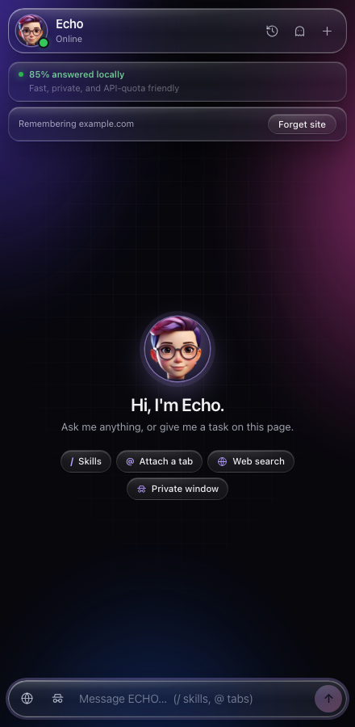 |  | 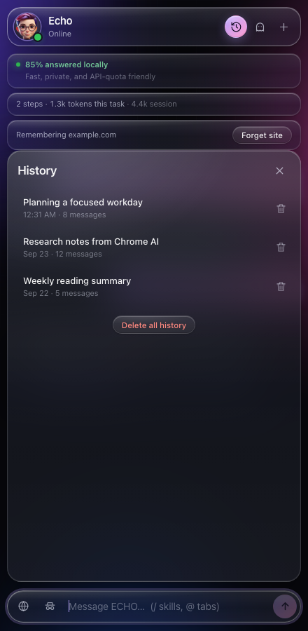 |

It includes:

- Saved and temporary chats.
- Tier badges for instant, cached, on-device, and cloud answers.
- Cited sources for supported web-search answers.
- Per-task and per-session cloud token counters.
- The percentage of requests answered locally.
- Page-memory controls for the active site.
- Chat history with reopen and delete actions.
- `/` skill completion and `@` tab completion.
- Web-search and private-window switches.
- A visible stop button while work is running.
- Approval prompts and recent action logs.

### Settings

Settings are grouped in plain language so casual users can configure ECHO without understanding its architecture.

<table>
  <tr>
    <td>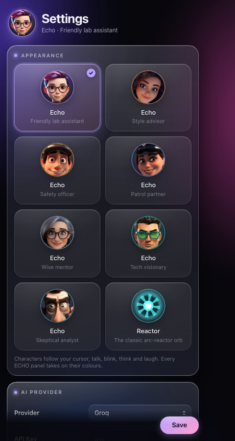</td>
    <td>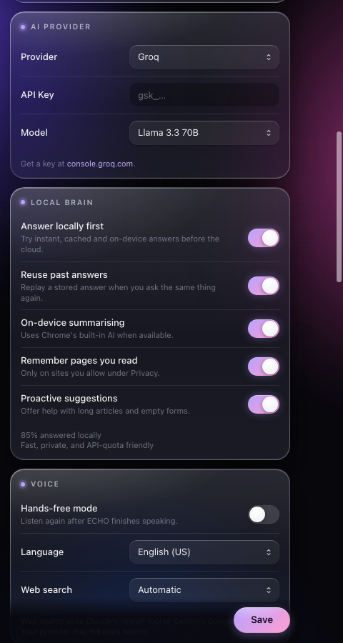</td>
  </tr>
  <tr>
    <td>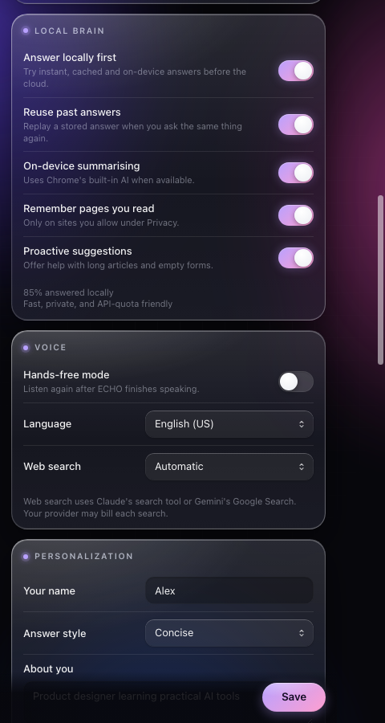</td>
    <td>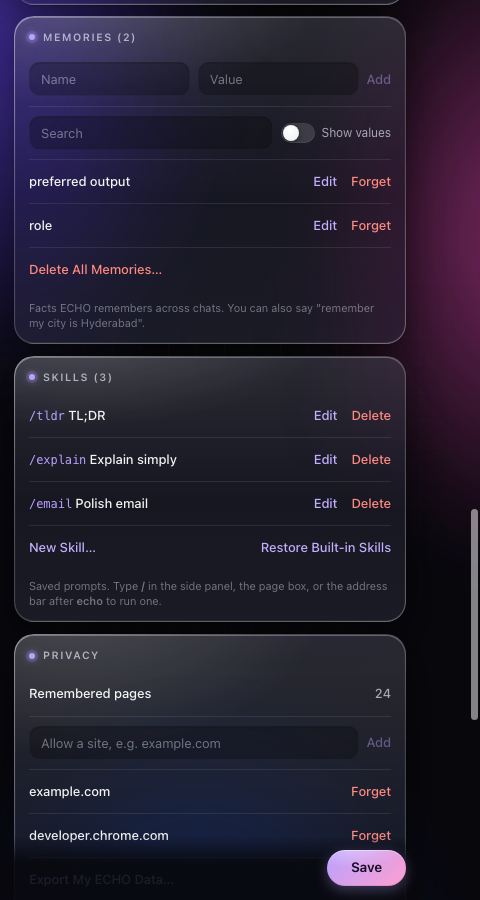</td>
  </tr>
  <tr>
    <td>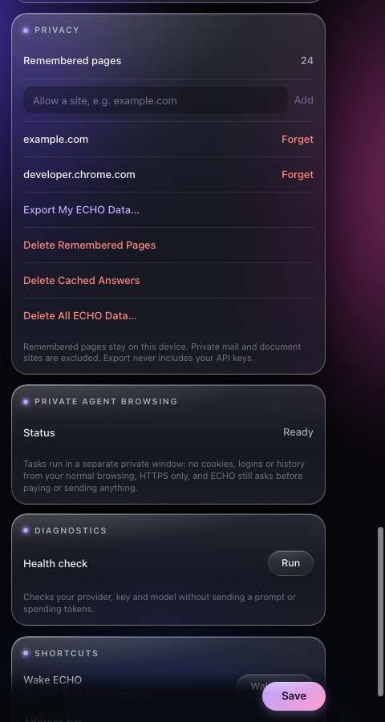</td>
    <td>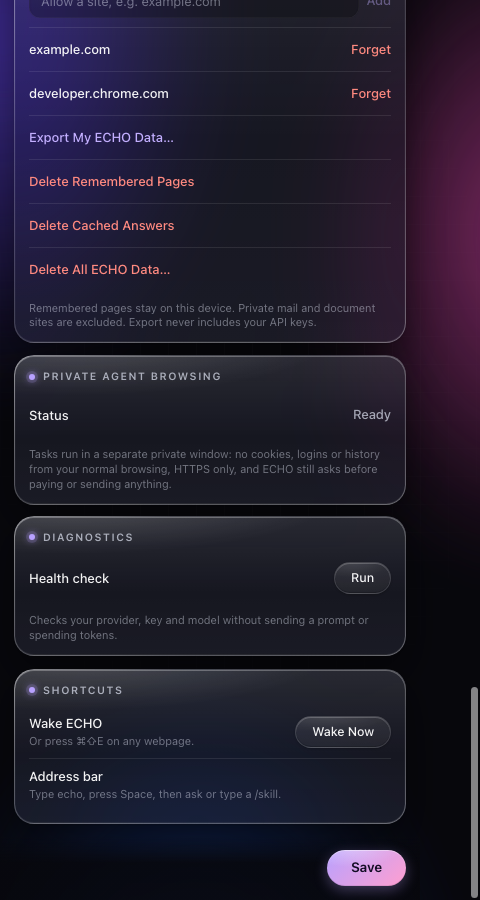</td>
  </tr>
</table>

#### Appearance

Choose one of seven animated ECHO personalities or the original reactor:

| Appearance | Personality | Voice |
| --- | --- | --- |
| Echo | Friendly lab assistant | Female |
| Echo Style | Style advisor | Female |
| Echo Officer | Safety officer | Male |
| Echo Patrol | Patrol partner | Female |
| Echo Mentor | Wise mentor | Female |
| Echo Visionary | Tech visionary | Male |
| Echo Analyst | Skeptical analyst | Male |
| Reactor | Classic arc-reactor orb | Uses the selected system voice |

The selected character's palette automatically themes every ECHO surface.

#### AI Provider

Choose a provider, enter its API key, and select or enter a supported model. Only the active provider is used for cloud-tier requests.

#### Local Brain

- **Answer locally first:** tries deterministic, cached, and on-device answers before the cloud.
- **Reuse past answers:** stores suitable answers and replays them for matching questions.
- **On-device summarising:** uses Chrome's built-in AI when available, with an extractive fallback.
- **Remember pages you read:** locally indexes allowed sites for later recall.
- **Proactive suggestions:** offers help on long articles and forms without starting a cloud request.

#### Voice

- **Hands-free mode:** reopens the microphone after ECHO finishes speaking.
- **Language:** English (US/UK), Hindi, Telugu, Tamil, Bengali, Spanish, French, and German.
- **Web search:** automatic when useful, or only when explicitly requested.

#### Personalization

Set your name, preferred answer style, background information, and custom instructions. Personalization is stored locally and can be disabled or edited at any time.

#### Memories

Review, search, add, edit, reveal, forget, or delete remembered facts. You can also teach ECHO conversationally—for example, “remember that my city is Hyderabad.”

#### Skills

Skills are reusable prompts with short `/commands`. Create your own, edit existing ones, or restore the built-in set.

#### Privacy and data controls

- See how many pages are remembered.
- Allow page memory one domain at a time.
- Forget a domain and remove its saved pages and highlights.
- Export ECHO data without API keys.
- Delete remembered pages, cached answers, or all ECHO data.

#### Private Agent Browsing

Runs browser tasks in a separate incognito window with no normal cookies, logins, or browsing history. HTTPS is required, and payment or send actions still require approval. Chrome's **Allow in Incognito** permission must be enabled first.

#### Diagnostics

Checks browser permissions, the active tab, provider configuration, API-key presence, and model availability without sending a prompt or spending tokens.

---

## Complete feature guide

### Understand pages

- Read visible text and a numbered index of interactive elements.
- Extract long pages in safe chunks rather than silently truncating them.
- Summarize locally or with a selected AI provider.
- Answer questions from page content.
- Explain selected text in simple language.
- Extract tables as structured JSON.
- Capture the visible page for genuinely visual questions.
- Find and highlight matching text.
- Translate page content.

### Navigate and operate websites

- Open URLs and wait for navigation to finish.
- Click indexed elements rather than brittle pixel coordinates.
- Type using native setters so React and Vue forms detect changes.
- Press keys, scroll, switch tabs, close tabs, and list open tabs.
- Search supported websites through direct search URLs.
- Track the correct active tab across multi-step tasks.

### Fill forms safely

ECHO scores visible fields against saved profile information and fills only safe matches. It deliberately refuses:

- Passwords.
- Card numbers and CVV codes.
- PINs.
- Social-security numbers.
- Bank or account numbers.
- Fields that already contain user-entered text.

It fills but does not submit the form. You remain in control of the final action.

### Record and replay workflows

Say **“record a workflow”**, perform a sequence, then stop and name it. ECHO records committed clicks, typing, dropdown choices, scrolling, and navigation.

Each recorded element keeps several selector candidates plus a readable label. Playback tries them in order and falls back to label matching, making workflows more resilient to generated IDs and changing CSS classes. Password and payment fields are not recorded.

### Monitor pages

Create a watcher for:

- Any content change.
- A value moving below or above a threshold.
- Text appearing.
- An element disappearing.
- A price reaching a target.

Chrome alarms reopen the page in a background tab, evaluate the condition, and show a desktop notification. Watchers survive browser restarts and re-arm when their condition becomes false again.

### Extract useful information

Built-in local extractors find:

- Email addresses.
- Phone numbers with plausibility filtering.
- Prices in multiple currencies.
- Links.
- Dates in common formats.
- Social-media handles.
- Page headings.
- Tables and structured page content.

### Remember pages and highlights

- Opt in one site at a time.
- Save selected passages as highlights.
- Restore highlights when revisiting a page.
- Export highlights as Markdown.
- Ask “what did I read today?” or recall an article by topic.
- Rank page memory by title, domain, body matches, and recency.

ECHO automatically excludes private destinations such as mail, online documents, authentication pages, account pages, and token-bearing URLs.

### Search the web with citations

Claude and Gemini can perform live web searches when supported by the selected model and account. Search answers can include numbered markers and a source list in the side panel. Web search can be automatic or explicitly controlled per message.

### Work with video

On supported video pages, ECHO can retrieve and parse timed transcripts. This enables summaries, topic lookup, and questions about the spoken content without treating the visual page layout as the transcript.

### Rewrite selected text

ECHO Writer captures exactly the selected text inside an editable field. It refuses stale selections and secret fields, removes unwanted model wrappers, and offers **Copy** or **Replace** instead of changing the page automatically.

### Use voice naturally

- Speech recognition runs in a sandboxed extension frame so it works consistently across sites.
- Spoken replies use browser speech synthesis.
- Character voice gender remains consistent with the selected avatar.
- Mouth shapes are generated from the reply text and corrected by speech boundary events when the browser provides them.
- Hands-free mode continues the conversation after each answer.

### Create reusable skills

Turn a good prompt into `/tldr`, `/email`, `/explain`, or your own shortcut. Skills work in the side panel, page command bar, and address bar.

### Attach tab context

Type `@` in the side panel to attach an open tab. Attached content is fenced and explicitly treated as untrusted page data rather than system instructions.

### Use a private agent window

Private mode confines the task to a separate incognito window, requires HTTPS, and prevents tools from silently escaping back into the normal signed-in browsing context.

---

## How the local-first brain works

```text
User request
     │
     ▼
┌──────────────────────┐
│ Smart request router │
└──────────┬───────────┘
           │
   ┌───────┼──────────┬────────────┐
   ▼       ▼          ▼            ▼
Tier 0   Tier 1     Tier 2       Tier 3
Instant  Cache      On-device    Cloud model
rules    + memory   AI/fallback  + tools
   │       │          │            │
   └───────┴──────────┴────────────┘
           │
           ▼
 Answer with a visible tier label
```

| Tier | What it handles | Typical cost | Can decline? |
| --- | --- | --- | --- |
| Tier 0 — Instant | Direct navigation, memory lookups, extractors, workflows, form filling, watchers, tab commands | Free and local | Yes |
| Tier 1 — Cached | Matching prior answers and local knowledge recall | Free and local | Yes |
| Tier 2 — On-device | Summaries and page-grounded questions through Chrome AI or the extractive fallback | Free and local | Yes |
| Tier 3 — Cloud | Open-ended reasoning, complex agentic tasks, and live web search | Uses provider quota | Final tier |

The important rule is that each local tier may say **“I am not confident”** and pass the request onward. A fast local guess is not considered a success.

### Why this saves tokens

- Simple work never sends a prompt.
- Repeated questions reuse suitable answers.
- Old tool output is compacted before the next model step.
- Only relevant tool definitions are sent for a request.
- The agent loop has a hard step cap and abort support.
- Cloud results can be written back to the cache.
- Real provider usage fields feed the visible token counter.

---

## Privacy and safety model

ECHO can operate websites, so its boundaries are designed to be visible and conservative.

### Local by default

- Settings, memories, workflows, watchers, highlights, chat history, and the page index live in Chrome storage or IndexedDB on the device.
- Page memory is opt-in per domain.
- Private sites and sensitive URL patterns are automatically excluded.
- Data export omits API keys.

### Approval before consequential actions

ECHO asks before actions that can pay, send an email, or send a message. Approval is tied to the originating tab so another page cannot approve it.

### Prompt-injection boundaries

- Page text, attached tabs, browser results, and tool output are treated as untrusted data.
- Proactive page messages may only select from a fixed allowlist of harmless local actions.
- Navigation rejects executable schemes such as `javascript:` and `data:`.
- Screenshot capture refuses to capture a different active tab.

### Important permission explanations

| Permission | Why ECHO needs it |
| --- | --- |
| `activeTab` / `scripting` | Read and interact with the page you ask ECHO to use |
| `tabs` | Navigate, switch, list, and manage tabs during tasks |
| `storage` / `unlimitedStorage` | Save settings, chats, workflows, cache, highlights, and local knowledge |
| `sidePanel` | Provide persistent chat beside the webpage |
| `alarms` / `notifications` | Check page watchers and notify you when conditions match |
| `downloads` | Export user-requested data and highlights |
| `contextMenus` | Offer ECHO actions on selected page text |
| `<all_urls>` host access | Run the assistant on the sites where you explicitly invoke it |

---

## Troubleshooting

### ECHO does not appear on a page

1. Reload the page after installing or rebuilding the extension.
2. Press `Ctrl/Cmd + Shift + E`.
3. Confirm the extension is enabled at `chrome://extensions`.
4. Chrome does not allow extensions to run on some internal pages such as `chrome://settings`.

### The cloud provider does not answer

1. Open ECHO **Options**.
2. Confirm the selected provider, API key, and model.
3. Run **Diagnostics → Health check**.
4. Check that the provider account has quota and access to the selected model.
5. Try a local command such as “extract all emails” to verify the extension itself is working.

### Voice input does not work

- Allow microphone access when Chrome asks.
- Confirm the selected language in **Settings → Voice**.
- Close other applications that may exclusively hold the microphone.
- Reload the webpage after changing extension permissions.

### Private browsing says setup is required

Open `chrome://extensions`, select ECHO's **Details**, and enable **Allow in Incognito**. ECHO does not enable this permission automatically.

### A recorded workflow cannot find an element

The website may have changed its labels or layout. Record that step again. ECHO deliberately avoids replaying against ambiguous or sensitive elements.

### Chrome says the unpacked extension is missing

The extracted or `dist/` folder was probably moved. Remove the broken entry from `chrome://extensions` and load the folder again from its permanent location.

---

## Developer guide

### Technology

| Area | Implementation |
| --- | --- |
| Language | TypeScript 5 in strict mode |
| UI | React 19 with custom CSS and no component framework |
| Build | webpack 5 and `ts-loader` |
| Platform | Chrome Extension Manifest V3 |
| Background | Restart-safe service worker with persisted task state |
| Local data | Chrome storage plus IndexedDB |
| On-device AI | Chrome `Summarizer` / `LanguageModel`, feature-detected |
| Cloud AI | Claude, Gemini, Groq, Together AI, OpenRouter |
| Voice | Web Speech API in a sandboxed extension frame |
| Testing | Node's built-in test runner with TypeScript module harnesses |

### Architecture

```text
┌──────────────────────────────────────────────────────────────┐
│ User interfaces                                              │
│ Floating avatar + command bar │ Side panel │ Settings        │
└───────────────────────────────┬──────────────────────────────┘
                                │ Chrome messages
┌───────────────────────────────▼──────────────────────────────┐
│ MV3 background service worker                               │
│ Router · local brain · cache · provider brain · safety bus  │
│ workflows · watchers · chats · memories · web search        │
└───────────────┬───────────────────────────┬──────────────────┘
                │                           │
┌───────────────▼──────────────┐  ┌────────▼──────────────────┐
│ Content script              │  │ Local persistence         │
│ DOM index · actions         │  │ Chrome storage · IndexedDB│
│ recorder · form filler      │  │ cache · KB · highlights   │
│ highlighter · writer        │  └───────────────────────────┘
│ transcript · page UI        │
└──────────────────────────────┘
```

### Project structure

```text
.
├── manifest.json                    Chrome MV3 manifest
├── webpack.config.js                Production bundling
├── src/
│   ├── background/
│   │   ├── smart-router.ts          Four-tier request dispatch
│   │   ├── local-brain.ts           Deterministic intent rules
│   │   ├── response-cache.ts        Normalized TTL answer cache
│   │   ├── local-llm.ts             Chrome AI + extractive fallback
│   │   ├── brain.ts                 Cloud provider agent loops
│   │   ├── safety.ts                Navigation and approval boundaries
│   │   ├── workflow-engine.ts       Record/replay orchestration
│   │   ├── page-watcher.ts          Alarm-driven monitoring
│   │   ├── knowledge-base.ts        Local page recall
│   │   ├── chats.ts                 Saved and temporary chats
│   │   └── tools.ts                 Browser tool dispatch
│   ├── content/
│   │   ├── actions.ts               Indexed DOM and browser actions
│   │   ├── avatar.tsx               Real-time avatar animation engine
│   │   ├── ui.tsx                   Floating assistant and command bar
│   │   ├── recorder.ts              Resilient selector capture/replay
│   │   ├── form-filler.ts           Safe profile-based form filling
│   │   ├── writer.ts                Selection-bound rewrite flow
│   │   └── video-transcript.ts      Timed transcript parsing
│   ├── popup/
│   │   ├── sidepanel.tsx            Persistent chat workspace
│   │   └── options.tsx              Complete settings interface
│   ├── characters/                  Character registry and themes
│   └── assets/characters/           Layered avatar artwork
├── tests/extension.test.cjs         Security, routing, workflow and UI logic tests
├── tools/avatar/                     Avatar asset-generation pipeline
├── tools/docs/                       Reproducible screenshot/video harness
├── docs/screenshots/                 README screenshots
└── docs/media/                       Avatar MP4, GIF preview and poster
```

### Commands

| Command | Purpose |
| --- | --- |
| `npm install` | Install dependencies |
| `npm run build` | Build the production extension into `dist/` |
| `npm test` | Run the automated test suite |
| `npm run docs:showcase` | Build the documentation sandbox |
| `npm run docs:capture` | Rebuild and regenerate screenshots plus avatar video; requires Chrome and FFmpeg |

### Testing coverage

The committed suite currently exercises 40 behaviors, including:

- Page-scoped cache isolation.
- Sensitive-field redaction and typing refusal.
- Executable URL rejection.
- Private-site and token-bearing URL exclusions.
- Tab-bound action approval.
- Service-worker restart recovery.
- Long-page chunking.
- Active-tab screenshot safety.
- Workflow recording and replay.
- Dropdown and multi-select restoration.
- Skills and chat-history behavior.
- Personalization and temporary-chat isolation.
- Citation parsing.
- Video transcript parsing.
- ECHO Writer selection safety.
- Attached-tab prompt-injection fencing.
- Incognito task confinement.
- Character/voice matching.
- On-device AI timeout behavior.

### Documentation media

`tools/docs/capture-media.mjs` mounts the real production React components inside a deterministic local sandbox. Sample names, memories, chats, and URLs are fictional; no developer profile, API key, or browsing history is captured. The avatar reel uses the production `EchoAvatar` animation component and source artwork.

To regenerate everything:

```bash
npm run docs:capture
```

Requirements: macOS with Google Chrome at its standard application path and `ffmpeg` available on `PATH`.

---

## Current limitations

- The deterministic intent layer is deliberately conservative and can decline unfamiliar phrasing.
- Chrome's highest-quality built-in AI path is hardware- and browser-dependent; the extractive fallback remains available.
- A recorded workflow can require re-recording after a website significantly changes its labels or structure.
- Browser speech recognition and installed voices vary by operating system.
- Web search availability depends on the selected provider, model, account, and quota.
- This repository currently distributes an unpacked extension ZIP rather than a Chrome Web Store release.

---

## Contributing

1. Create a short-lived feature branch.
2. Keep changes focused and commits atomic.
3. Run `npm test` and `npm run build`.
4. Include screenshots for visible interface changes.
5. Never commit real API keys, browser profiles, private page content, or generated `dist/` output.
6. Explain user-facing behavior and privacy implications in the pull request.

---

## License

ISC. See [package.json](package.json) for the current package metadata.
